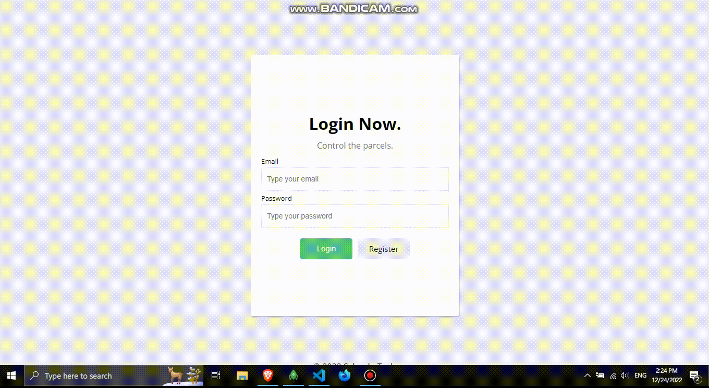

## Saloodo Task

#### A JavaScript task required by Saloodo.

### Task Java Script: A private delivery service company in Cologne handles the collection and delivery of parcels for people.

## Key Features.

<ul>
  <li>A sender should be able to create a parcel to be delivered by specifying pick-up and drop-off address (should be just a text field, no need for address validation</li>
  <li>A sender should be able to see the status of his parcels.</li>
  <li>A biker should be able to see a list of the parcels.</li>
  <li>A biker should be able to pick up a parcel.</li>
  <li>Once a parcel is picked up by a biker, it cannot be picked up by other bikers.</li>
  <li>A biker should be able to input the timestamp of the pickup and the delivery for each order.</li>
  <li>The status of the order should be updated for the sender.</li>
</ul>

## A developer should create two tools:

<ul>
  <li>A web dashboard for the sender.</li>
  <li>A to-do web tool for the biker.</li>
</ul>

## Technical hints:

<ul>
  <li>Hard-code 5 senders and 10 bikers.</li>
  <li>Create a Node.js based API server responsible for mocking authentication of the senders and
the bikers, and for serving mock data, via REST API</li>
  <li>You might consider dockerising the application and if you want you can provide a docker-
compose file</li>
</ul>

#### Task Demo!

